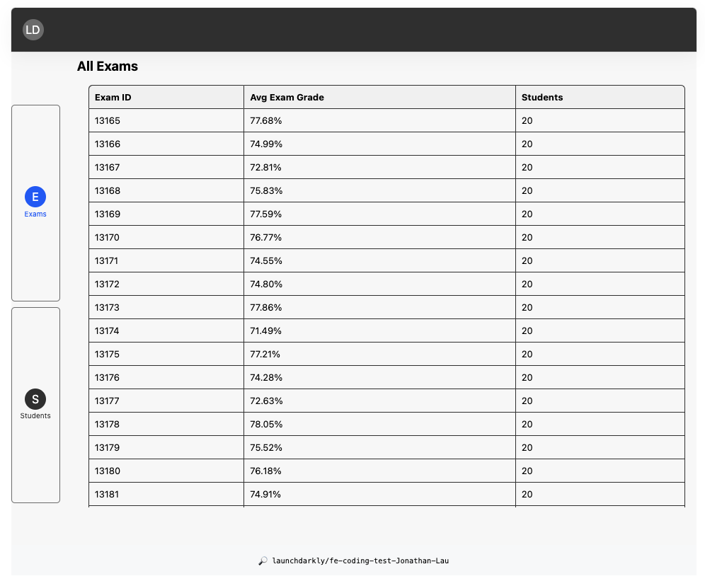
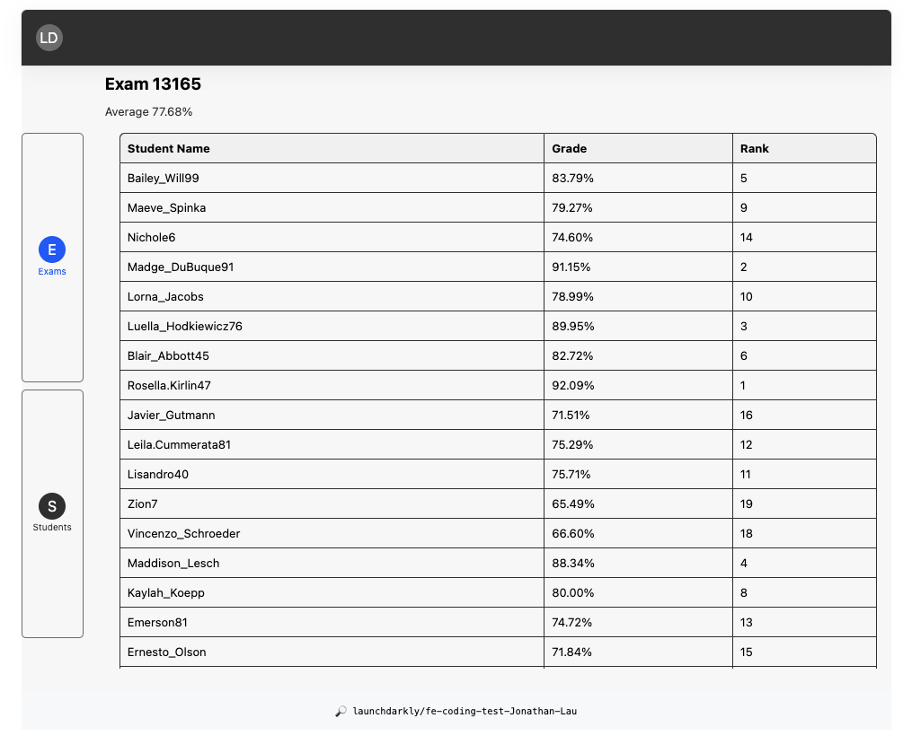

# Frontend Coding Challenge

## Overview

This project implements a frontend for the coding challenge using a component architecture with TypeScript and an event-driven approach.

| Screen 1                         | Screen 2                            |
| -------------------------------- | ----------------------------------- |
|  |  |

## Requirements Checklist

- [x] We should be able to run it using the instructions in this README.
- [x] The exam list and detail views should display data from the API properly based on the wireframe above.
- [x] The user experience should be intuitive and user-friendly.
- [x] Your solution must respect the constraints above.

### Misc. Implementations

- Typescript setup
- Prettier configuration
- Script configuration

## Architecture

The frontend is built using Web Components and custom elements to encapsulate logic and markup. TypeScript provides type safety and tooling.

### Event Flow

An event-driven architecture with producers, broker, and consumers is used for loose coupling. Key components are:

- `app-events` - Event broker that fetches data and dispatches events
- `app-router` - Event consumer that listens for navigation and renders views.
- `app-view-toggle` - Event producer that emits custom events to fetch data for the active view.

#### Client Router

- `app-router` - Client side router implementation. Component is implemented as view outlet. Listens for event `router-change` to determine which view to display.
  - `RouterHandler` - Events are handled in RouterHandler class instance. It listens for changes to window url to

#### Event Broker

- `app-events` - listens and fetches data, then dispatches examsDataLoaded

Example:

```js
 /**
   * Example usage
   * Fetches exam data from the API and emits a custom event with the data.
   *
   * @fires AppEvents#eb-examsData - Emits event with exams data payload.
   */
  private async fetchExamsData(): Promise<void> {
    const url = `${this.baseApiUrl}/exams`;

    try {
      const response = await fetch(url);
      if (!response.ok) {
        throw new Error('Network response was not ok');
      }
      const examsData = await response.json();

      // Emitting a custom event with the exams data.
      this.dispatchEvent(new CustomEvent('eb-examsData', {
        detail: examsData,
        bubbles: true,
        composed: true,
      }));
    } catch (error) {
      console.error('Failed to fetch exams data:', error);
      // Handle error state appropriately
    }
  }


  // Example of dispatching a request for exams data from a producer
  document.dispatchEvent(new CustomEvent('requestExamsData'));
```

#### Event Producer

- `app-view-toggle` - listens and renders the app-exams-view

#### Views

- `app-exams-view` - Renders the Exams view UI and handles exam data events.
- `app-students-view` - Not implemented, placeholder component for /students
  This decouples the data loading from the view rendering.

## UX Considerations

### Lazy-loading

In the entry initialization of the app, consideration for user experience is taken into account by preloading components that are not dependent on data fetch operations, such as `app-header` and `app-footer`.

These elements typically contain static information and good for giving the user a sense of immediate interaction and feedback when they load the application. By ensuring that these components are loaded first, users are presented with a complete frame of the application UI, thus enhancing the perceived performance of the app and contributing to a seamless user experience.

The initialize method uses `Promise.all` to load these components in parallel, further optimizing the loading time and ensuring that the structural components of the UI are rendered as quickly as possible, regardless of the status of data-dependent components or network latency in fetching dynamic content.

### Table Accessibility

Considerations for mouse events considered for interactive elements such as the side navigation and table rows.

## TypeScript

The TypeScript project is configured in tsconfig.json.

- Components are authored in .ts files.
- `tsc` compiles to .js files in static/js folder.
- Build is run on yarn build script.

## Project Structure

- `/static/index.html` - Entry point that loads index.js
- `index.ts` - Bootstraps the app by loading `app-events` and `app-router` and
- `components/` - Web components for UI
- `views/` - Top level view components

## Conclusion

This architecture allows for a scalable and maintainable frontend by decoupling concerns into reusable components with typed interfaces. The eventing scheme reduces direct dependencies between components.

## Areas for Improvement

- Browser `popstate` has some issues. We can address this by adding an event listener for window `popstate` event. It would look something like this:
  1. Listens for the browser's popstate event to handle browser navigation (e.g., back/forward).
  1. Listens for click events on anchor tags to intercept navigation requests.
  1. 1 Uses the history.pushState method to update the URL without a page reload.
  1. 1 Dispatches a custom `router-change` event that the `app-router` component can listen for to update the displayed view.
- Add loading indicators for page "busy" operations
- Keyboard navigation for accessibility
- Missing tests - tbd

### Misc Notes

**_Updating the UI after the initial API request was not addressed as stated in the project README._**

- To use the application and ensure that the UI displays the most current data:

- Navigate through the application
  - The UI updates automatically whenever you change the path. This is because the app-router listens for changes in the URL and triggers the relevant components to update the view.
  - Refresh data manually: If you need the latest data for exams, simply click on the "Exams" tab.
    This action emits a `requestExamsData` event, which the `app-events` component listens for.
  - Upon detecting this event, `app-events` fetches the most recent data from the API and dispatches an `eb-examsData` event.
  - The UI components responsible for displaying exam data listen for this event and update the view accordingly with the new data.
